# MODULUS - High Level Design (HLD)

## Table of Contents

1. [System Overview](#system-overview)
2. [Architecture Design](#architecture-design)
3. [System Components](#system-components)
4. [Data Flow](#data-flow)
5. [Technology Stack](#technology-stack)
6. [Deployment Architecture](#deployment-architecture)
7. [Security Architecture](#security-architecture)
8. [Scalability & Performance](#scalability--performance)

---

## System Overview

MODULUS is an end-to-end machine learning platform that simplifies the ML lifecycle from data ingestion to model deployment. The system provides an interactive web interface for automated data preprocessing, model training, and artifact export.

### Key Features

- **Automated Data Preprocessing** with AI-powered suggestions
- **Interactive Web Interface** for non-technical users
- **Multiple ML Domains** - Tabular, Computer Vision
- **Comprehensive Reporting** - EDA, training, and preprocessing reports
- **Reproducible Pipelines** with exportable artifacts

---

## Architecture Design

### High-Level Architecture

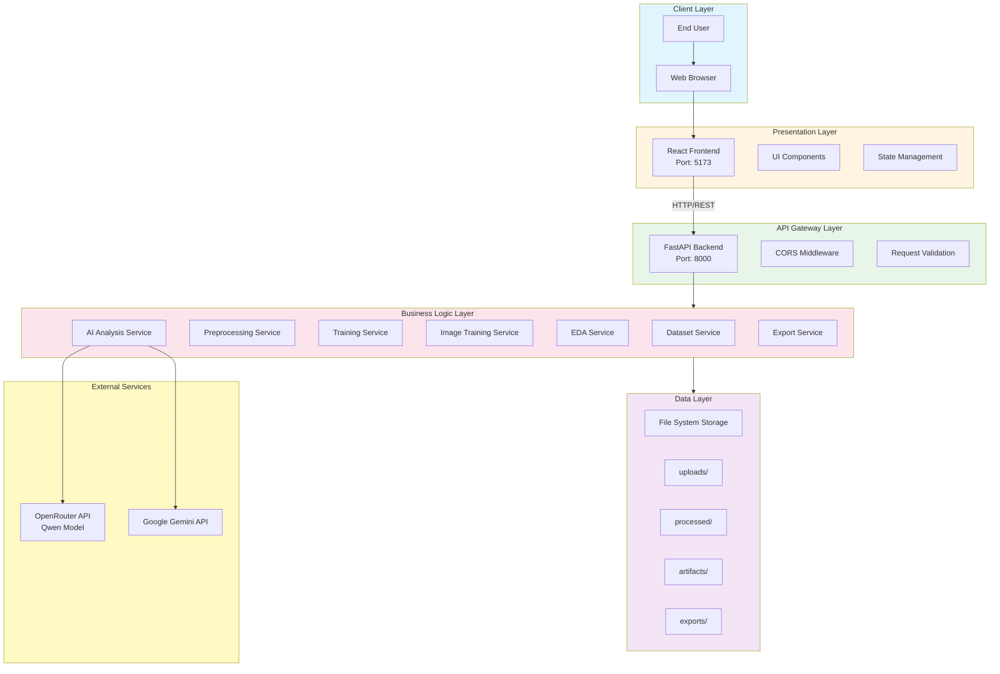

### System Architecture Layers

```mermaid
graph LR
    subgraph Layer1["Layer 1: Client"]
        Web["Web Browser"]
        Mobile["Mobile Browser<br/>(Future)"]
    end

    subgraph Layer2["Layer 2: Presentation"]
        Frontend["React SPA"]
        Static["Static Assets"]
    end

    subgraph Layer3["Layer 3: API Gateway"]
        Gateway["FastAPI"]
        Auth["Auth (Future)"]
        RateLimit["Rate Limiting"]
    end

    subgraph Layer4["Layer 4: Services"]
        S1["Dataset"]
        S2["Preprocessing"]
        S3["Training"]
        S4["EDA"]
        S5["AI Analysis"]
        S6["Export"]
    end

    subgraph Layer5["Layer 5: Storage"]
        FS["File System"]
        Cache["Cache<br/>(Future)"]
    end

    Layer1 --> Layer2
    Layer2 --> Layer3
    Layer3 --> Layer4
    Layer4 --> Layer5

    style Layer1 fill:#e1f5ff
    style Layer2 fill:#fff4e1
    style Layer3 fill:#e8f5e9
    style Layer4 fill:#fce4ec
    style Layer5 fill:#f3e5f5
```

---

## System Components

### Component Architecture

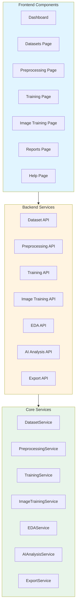

### Service Interaction Diagram

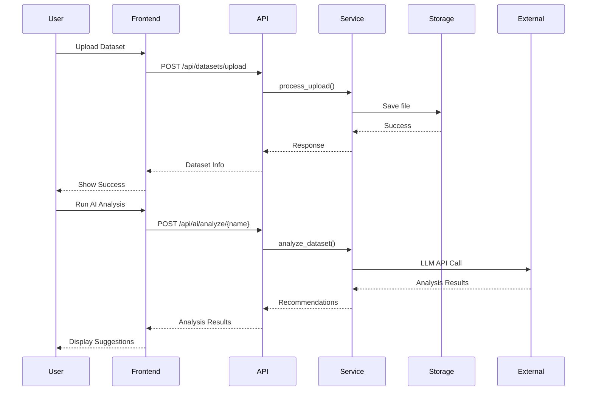

---

## Data Flow

### End-to-End Data Flow

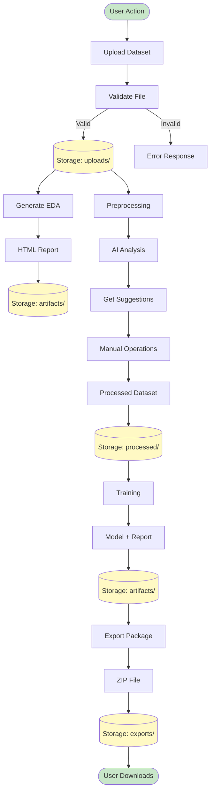

### Data Storage Structure

```
data/
├── uploads/              # Raw uploaded datasets
│   ├── dataset1.csv
│   ├── dataset2.parquet
│   └── image_autotrain/  # Image datasets
│
├── processed/            # Preprocessed datasets
│   ├── dataset1.parquet
│   └── dataset2.parquet
│
├── artifacts/            # Generated artifacts
│   ├── eda_report_*.html
│   ├── preprocessing_report_*.html
│   ├── training_report_*.html
│   ├── model_*.pkl
│   └── image_autotrain/  # CV training outputs
│
├── exports/              # Export packages
│   └── model_export_*.zip
│
└── bin/                  # Backup of original files
    └── timestamped_files/
```

---

## Technology Stack

### Technology Stack Overview

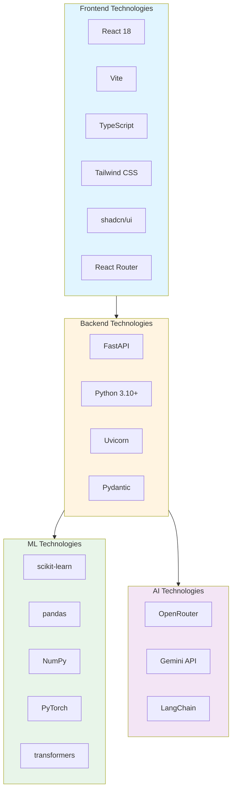

---

## Deployment Architecture

### Current Deployment (Local)

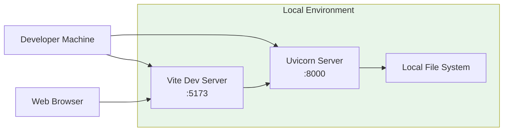

### Future Cloud Deployment

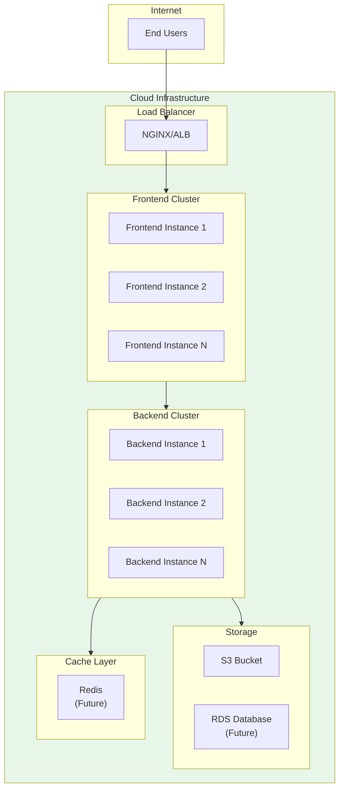

---

## Security Architecture

### Security Layers

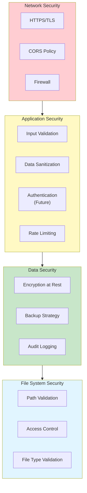

---

## Scalability & Performance

### Scalability Design

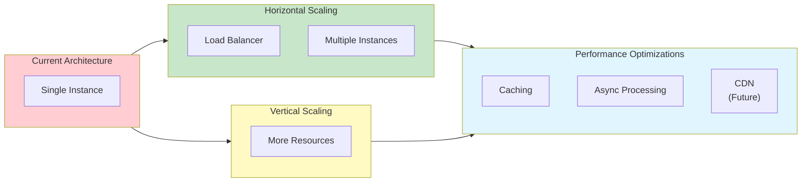

### Performance Characteristics

| Component         | Current Performance | Target Performance |
| ----------------- | ------------------- | ------------------ |
| API Response Time | < 180ms (p95)       | < 100ms (p95)      |
| Concurrent Users  | 120+                | 1000+              |
| Data Processing   | 1.2M rows/min       | 5M+ rows/min       |
| Training Time     | 3-18 min (10k rows) | < 10 min           |
| EDA Generation    | < 45s (100k rows)   | < 30s              |

---

## System Boundaries

### In Scope

- ✅ Tabular data preprocessing
- ✅ Tabular model training (classification/regression)
- ✅ Computer vision model training (CLI)
- ✅ EDA report generation
- ✅ AI-powered analysis
- ✅ Model export and packaging
- ✅ Web-based user interface

### Out of Scope (Future)

- ❌ Multi-user authentication
- ❌ Real-time collaboration
- ❌ Cloud storage integration
- ❌ Advanced hyperparameter tuning
- ❌ Model deployment infrastructure
- ❌ Model monitoring and serving

---

## Integration Points

### External System Integrations

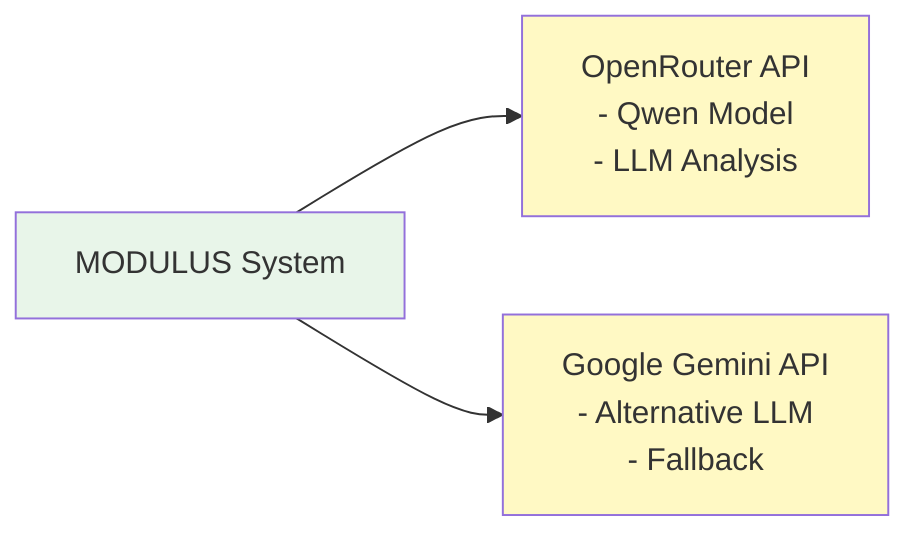

### Future Integration Points

- Cloud Storage (S3, Azure Blob)
- Model Registry (MLflow, Weights & Biases)
- CI/CD Pipelines
- Monitoring Tools (Prometheus, Grafana)
- Authentication Providers (OAuth, SSO)

---

## Non-Functional Requirements

### Performance Requirements

- API response time: < 200ms (95th percentile)
- Support 100+ concurrent users
- Process datasets up to 10GB
- Generate reports in < 60 seconds

### Scalability Requirements

- Horizontal scaling capability
- Stateless service design
- Efficient resource utilization

### Security Requirements

- HTTPS in production
- Input validation and sanitization
- Path traversal protection
- File type validation

### Reliability Requirements

- 99% uptime target
- Graceful error handling
- Automatic recovery from transient failures
- Data backup and recovery

### Usability Requirements

- Intuitive user interface
- Responsive design (desktop/tablet)
- Comprehensive help system
- Keyboard shortcuts for power users

---

## Design Decisions

### Key Design Decisions

1. **Microservices Architecture**: Modular design allows independent scaling and updates
2. **RESTful API**: Standard HTTP/REST for simplicity and interoperability
3. **File-based Storage**: Local filesystem for simplicity; extensible to cloud
4. **Async Processing**: Background jobs for long-running operations
5. **TypeScript Frontend**: Type safety and better developer experience
6. **FastAPI Backend**: High performance, automatic documentation, async support
7. **AI Integration**: Dual LLM support (OpenRouter + Gemini) for reliability
8. **Hybrid Preprocessing**: AI suggestions + manual control for flexibility

---

## Risk Assessment

### Technical Risks

| Risk                    | Impact | Probability | Mitigation                   |
| ----------------------- | ------ | ----------- | ---------------------------- |
| API Rate Limits         | High   | Medium      | Caching, fallback mechanisms |
| Large File Handling     | Medium | High        | Streaming, chunking          |
| LLM API Failures        | Medium | Medium      | Fallback to heuristics       |
| Storage Exhaustion      | High   | Low         | Cleanup jobs, size limits    |
| Performance Degradation | Medium | Medium      | Caching, optimization        |

---

## Conclusion

MODULUS follows a modern, scalable architecture that separates concerns across presentation, API, business logic, and data layers. The system is designed for extensibility, allowing future enhancements while maintaining current functionality and performance.
