# MODULUS - Low Level Design (LLD)

## Table of Contents

1. [Component Design](#component-design)
2. [Database Schema](#database-schema)
3. [API Design](#api-design)
4. [Class Diagrams](#class-diagrams)
5. [Sequence Diagrams](#sequence-diagrams)
6. [Data Structures](#data-structures)
7. [Algorithm Design](#algorithm-design)
8. [Error Handling](#error-handling)

---

## Component Design

### Frontend Component Hierarchy

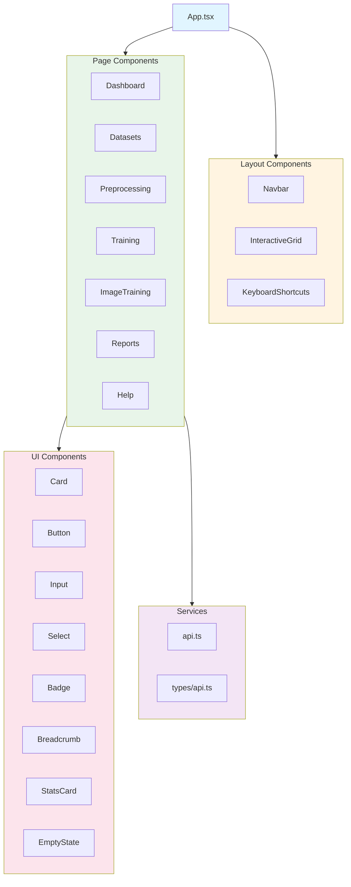

### Backend Service Architecture

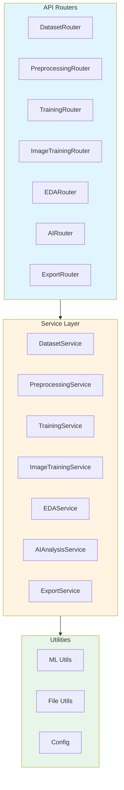

---

## Database Schema

### File System Schema (Current Implementation)

Since MODULUS uses file-based storage, the "database" is actually a structured file system:

```
data/
├── uploads/              # Dataset files
│   ├── {dataset_name}.csv
│   └── {dataset_name}.parquet
│
├── processed/            # Preprocessed datasets
│   └── {basename}.parquet
│
├── artifacts/            # Generated artifacts
│   ├── eda_report_{dataset}.html
│   ├── preprocessing_report_{job_id}.html
│   ├── training_report_{job_id}.html
│   └── model_{timestamp}.pkl
│
├── exports/              # Export packages
│   └── model_export_{job_id}_{timestamp}.zip
│
└── bin/                  # Backup files
    └── {timestamp}_{original_name}
```

### In-Memory Data Structures

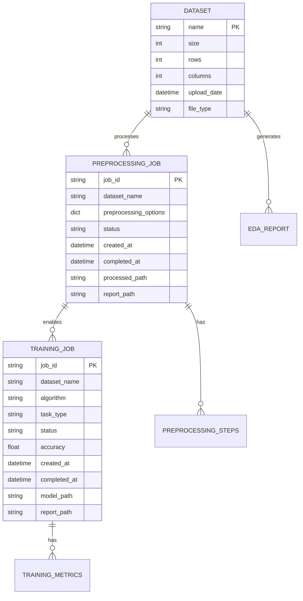

### Future Database Schema (SQL)

```sql
-- Datasets Table
CREATE TABLE datasets (
    id SERIAL PRIMARY KEY,
    name VARCHAR(255) UNIQUE NOT NULL,
    size BIGINT NOT NULL,
    rows INTEGER NOT NULL,
    columns INTEGER NOT NULL,
    upload_date TIMESTAMP DEFAULT CURRENT_TIMESTAMP,
    file_type VARCHAR(10),
    file_path VARCHAR(500),
    metadata JSONB
);

-- Training Jobs Table
CREATE TABLE training_jobs (
    id UUID PRIMARY KEY,
    dataset_name VARCHAR(255) REFERENCES datasets(name),
    algorithm VARCHAR(100) NOT NULL,
    task_type VARCHAR(20) NOT NULL,
    target_column VARCHAR(255) NOT NULL,
    status VARCHAR(20) NOT NULL,
    accuracy FLOAT,
    created_at TIMESTAMP DEFAULT CURRENT_TIMESTAMP,
    completed_at TIMESTAMP,
    model_path VARCHAR(500),
    report_path VARCHAR(500),
    metrics JSONB,
    config JSONB
);

-- Preprocessing Jobs Table
CREATE TABLE preprocessing_jobs (
    id UUID PRIMARY KEY,
    dataset_name VARCHAR(255) REFERENCES datasets(name),
    status VARCHAR(20) NOT NULL,
    preprocessing_options JSONB,
    created_at TIMESTAMP DEFAULT CURRENT_TIMESTAMP,
    completed_at TIMESTAMP,
    processed_path VARCHAR(500),
    report_path VARCHAR(500),
    quality_improvements JSONB
);

-- EDA Reports Table
CREATE TABLE eda_reports (
    id SERIAL PRIMARY KEY,
    dataset_name VARCHAR(255) REFERENCES datasets(name),
    report_path VARCHAR(500) NOT NULL,
    generated_at TIMESTAMP DEFAULT CURRENT_TIMESTAMP,
    summary JSONB
);
```

---

## API Design

### API Endpoint Structure

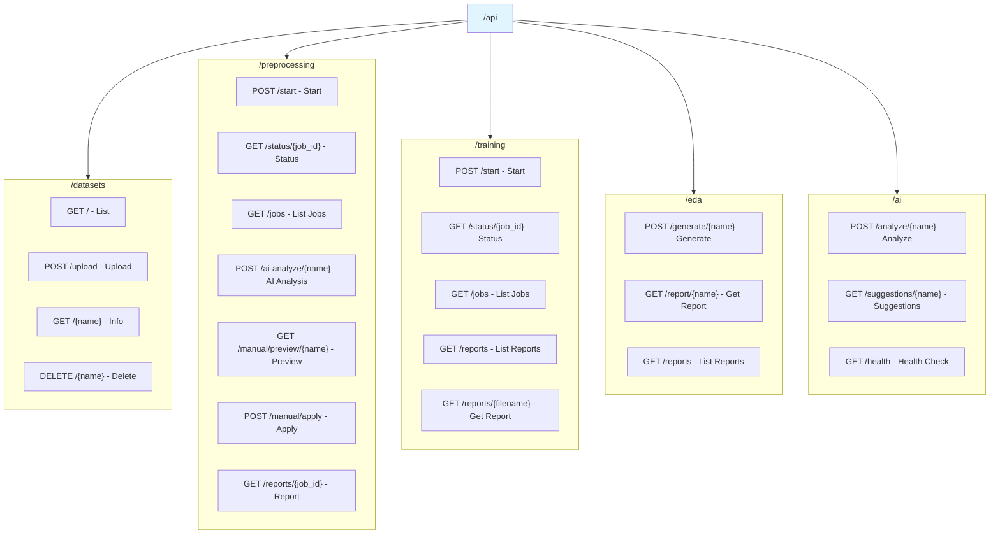

### API Request/Response Models

#### Training Request Schema

```typescript
interface TrainingRequest {
  dataset_name: string;
  task_type: "classification" | "regression";
  target_column: string;
  algorithm: string;
  test_size?: number; // 0.1 - 0.5
  random_state?: number;
  exclude_columns?: string[];
  ohe_columns?: string[]; // One-hot encoding
  scale_columns?: string[]; // Standard scaling
  null_handling?: string; // 'drop' | 'fill' | 'mean' | 'median' | 'mode'
  null_fill_value?: string | number;
  separator?: string; // CSV separator
}
```

#### Training Response Schema

```typescript
interface TrainingResponse {
  job_id: string;
  status: "pending" | "running" | "completed" | "failed";
  message: string;
}

interface TrainingResult {
  job_id: string;
  status: string;
  accuracy?: number;
  metrics: {
    precision?: number;
    recall?: number;
    f1_score?: number;
    roc_auc?: number;
    mae?: number;
    mse?: number;
    r2_score?: number;
  };
  model_path?: string;
  report_path?: string;
  error?: string;
}
```

---

## Class Diagrams

### Backend Service Classes

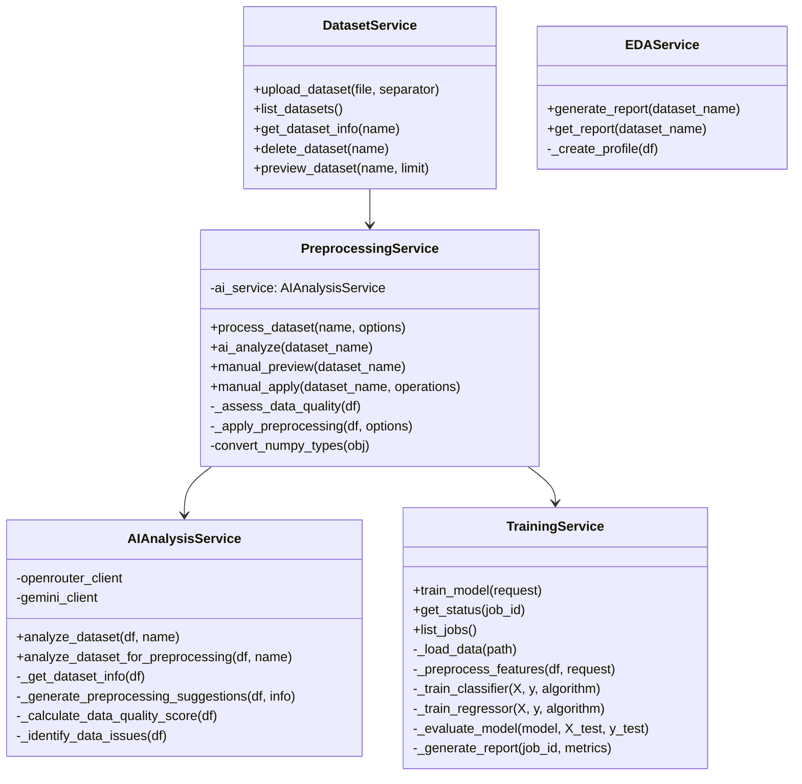

### Frontend Component Classes

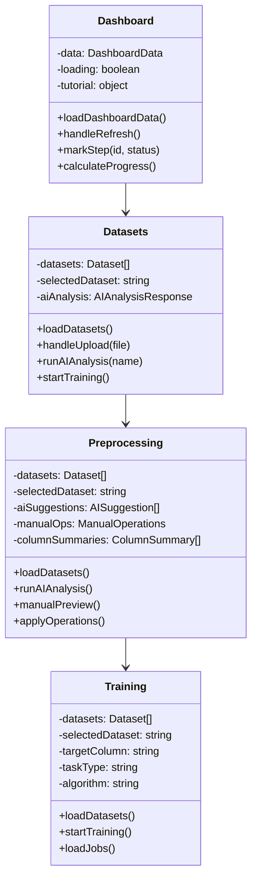

---

## Sequence Diagrams

### Dataset Upload Flow

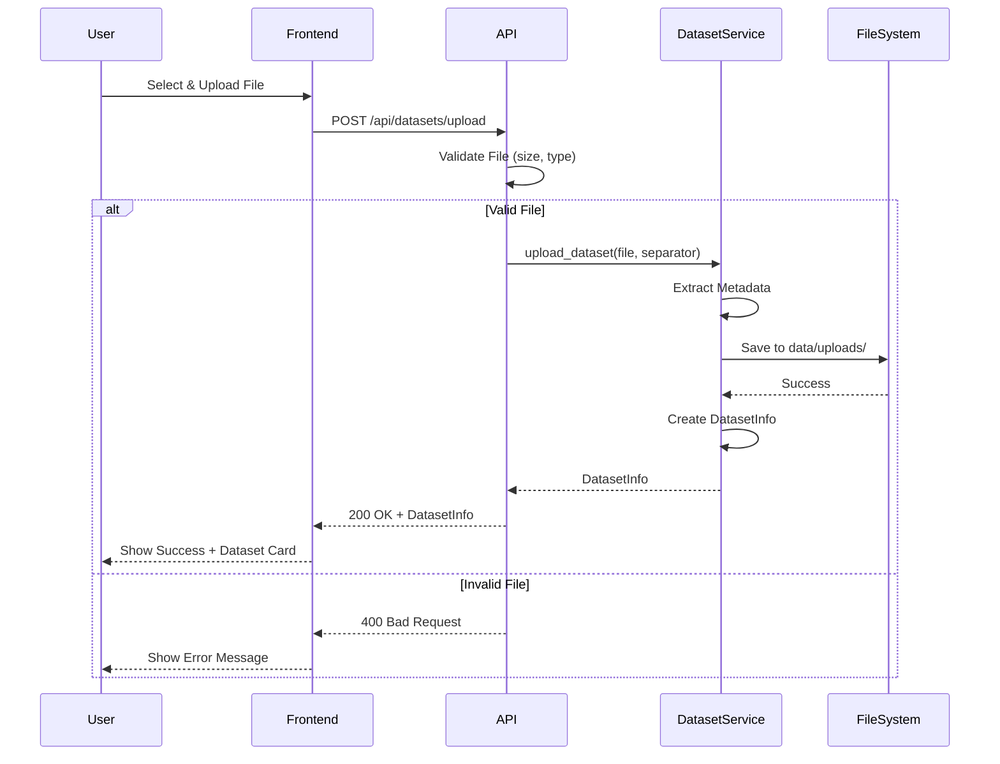

### Preprocessing Flow

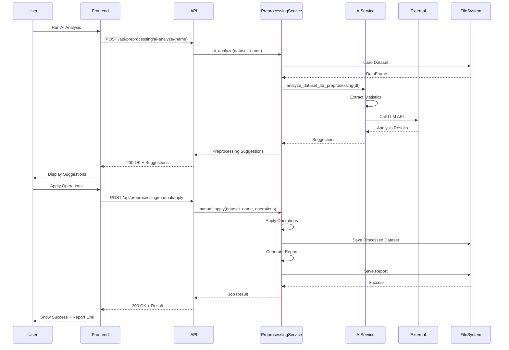

### Training Flow

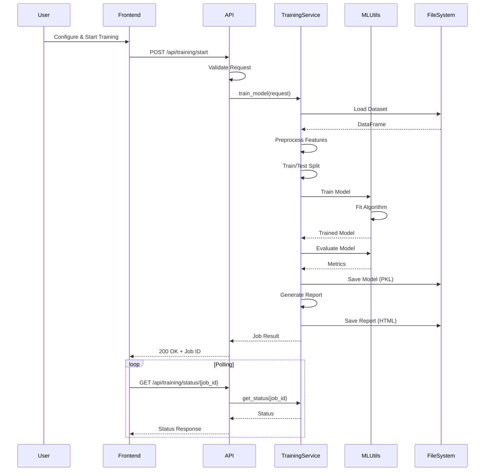

---

## Data Structures

### Core Data Models

#### DatasetInfo

```python
class DatasetInfo(BaseModel):
    name: str                    # Dataset filename
    size: int                    # File size in bytes
    rows: int                    # Number of rows
    columns: int                 # Number of columns
    upload_date: float          # Unix timestamp
    file_type: str = "csv"      # "csv" or "parquet"
```

#### TrainingJob

```python
class TrainingJob(BaseModel):
    job_id: str
    dataset_name: str
    algorithm: str
    target_column: str
    task_type: str              # "classification" or "regression"
    status: str                 # "pending" | "running" | "completed" | "failed"
    accuracy: Optional[float]
    error: Optional[str]
    created_at: str
    model_path: Optional[str]
    report_path: Optional[str]
```

#### PreprocessingJob

```python
class PreprocessingJob(BaseModel):
    job_id: str
    dataset_name: str
    status: str
    preprocessing_options: Dict[str, Any]
    created_at: str
    completed_at: Optional[str]
    result: Optional[Dict[str, Any]]
    report_path: Optional[str]
```

### Internal Data Structures

#### Preprocessing Log

```python
preprocessing_log = {
    "job_id": str,
    "dataset_name": str,
    "original_shape": tuple[int, int],
    "steps_applied": List[str],
    "ai_suggestions": List[Dict],
    "manual_options": Dict,
    "final_shape": tuple[int, int],
    "quality_improvements": {
        "missing_values_removed": int,
        "outliers_handled": int,
        "duplicates_removed": int,
        "columns_dropped": int,
        "type_conversions": int
    },
    "processing_time": float
}
```

---

## Algorithm Design

### Preprocessing Algorithm

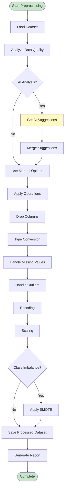

### Training Algorithm

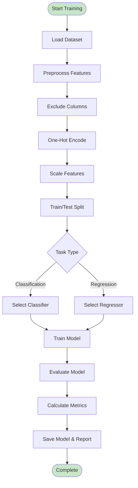

---

## Error Handling

### Error Handling Strategy

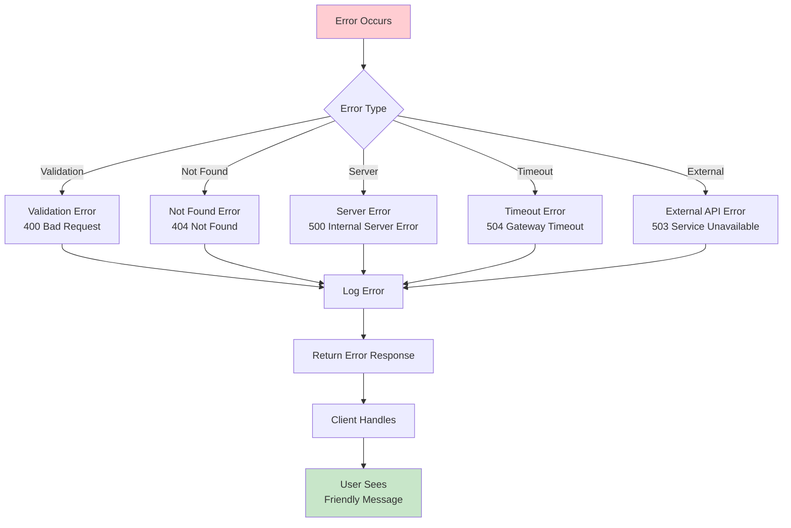

### Error Response Format

```python
class ErrorResponse(BaseModel):
    error: str
    detail: str
    code: str
    timestamp: str
```

### Exception Hierarchy

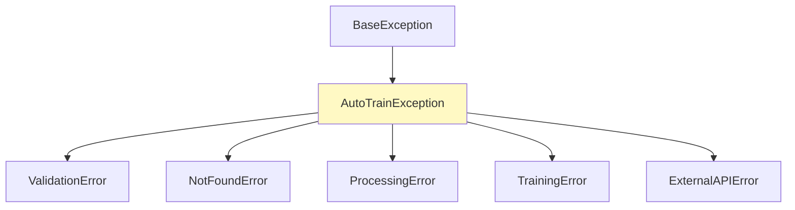

---

## Performance Optimization

### Caching Strategy

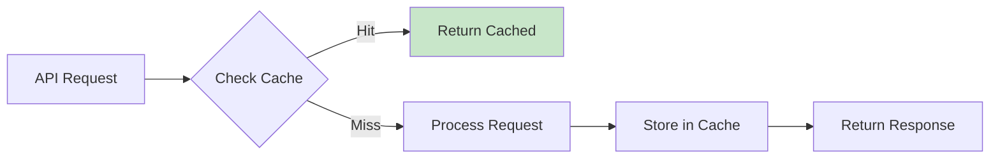

### Async Processing

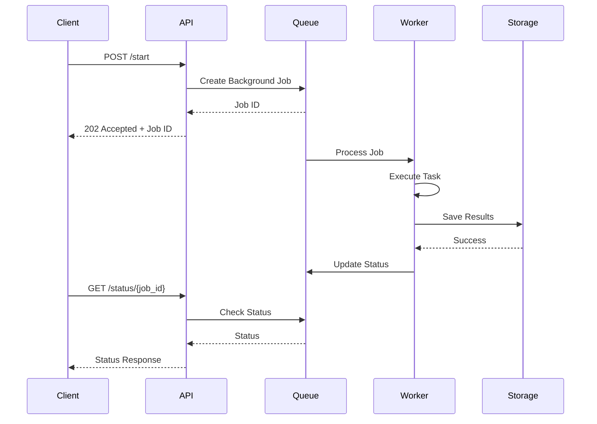

---

## Security Implementation

### Input Validation Flow

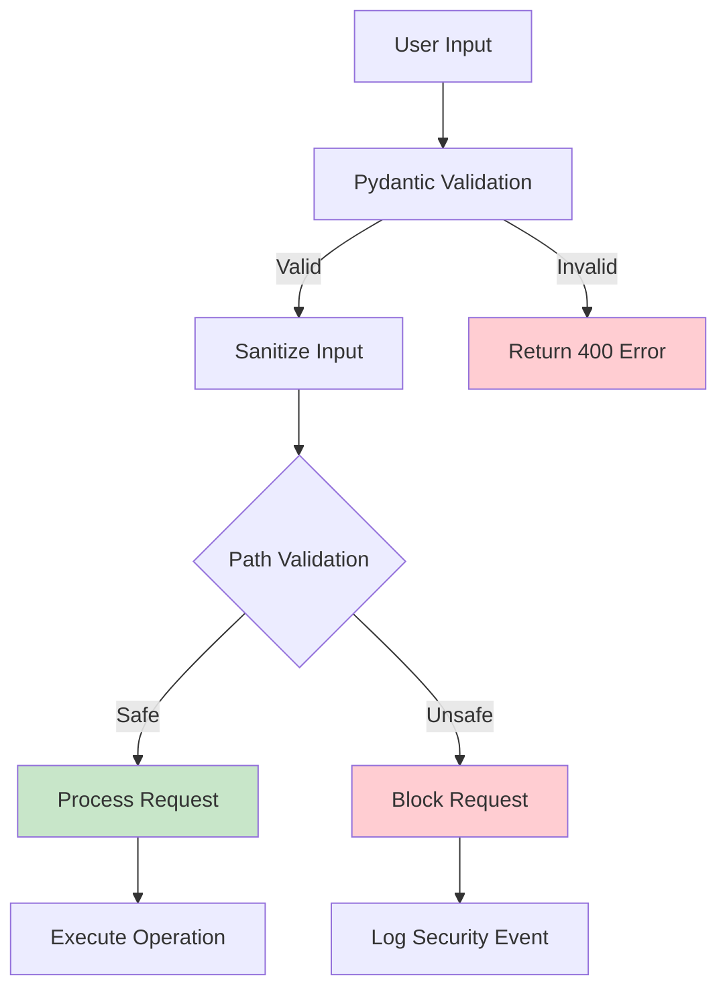

---

## Conclusion

The Low Level Design provides detailed specifications for each component, including class structures, data models, API endpoints, and algorithms. This design ensures consistent implementation and maintainability across the MODULUS platform.
