# MODULUS - Project Presentation
## Interactive Web Application for Data Preprocessing and Automated Machine Learning

---

## Slide 1: Title Slide

# 🚀 MODULUS
## Interactive Web Application for Data Preprocessing and Automated Machine Learning

**Team Members:**
- Aarya Deshpande
- Aashana Sonarkar  
- Duhazuhayr Ansari
- Anshul Khaire
- Upamanyu Bhadane
- Prof. Zarina K. M. (Guide)

**Vishwakarma Institute of Technology, Pune**

---

## Slide 2: Problem Statement

### The ML Workflow Challenge

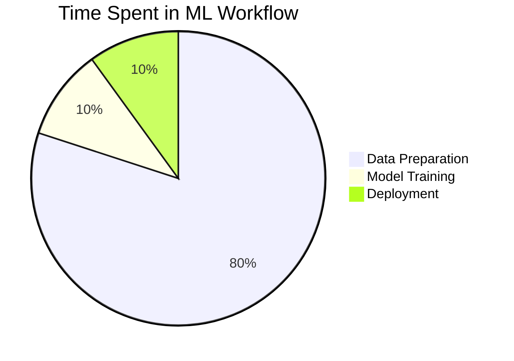

**Key Pain Points:**
- ⏱️ **80% of time** spent on data cleaning
- 🐛 **Error-prone** manual transformations
- 📝 **Lack of reproducibility**
- 💻 **Requires programming expertise**
- ⏳ **Weeks to months** time-to-model

---

## Slide 3: Solution Overview

### MODULUS: Your ML Companion

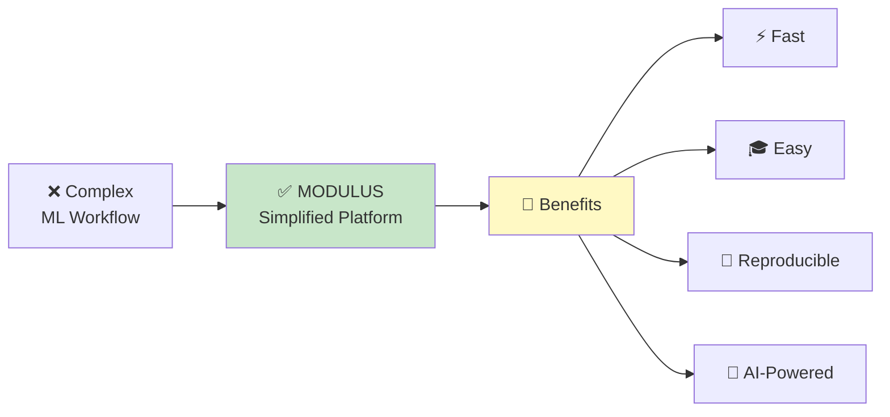

**What MODULUS Does:**
- Automates data preprocessing
- Provides AI-powered suggestions
- Trains models with one click
- Generates comprehensive reports
- Exports deployable artifacts

---

## Slide 4: Key Features

### 🎯 Core Features

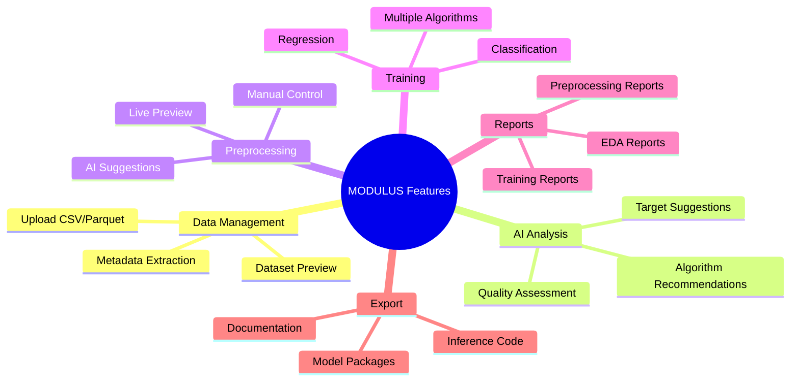

---

## Slide 5: System Architecture

### High-Level Architecture

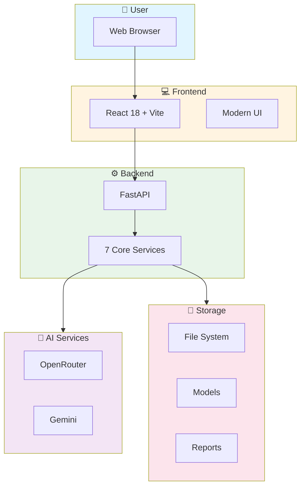

---

## Slide 6: Technology Stack

### Modern Tech Stack

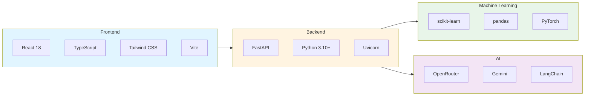

---

## Slide 7: Workflow

### Complete ML Workflow in MODULUS

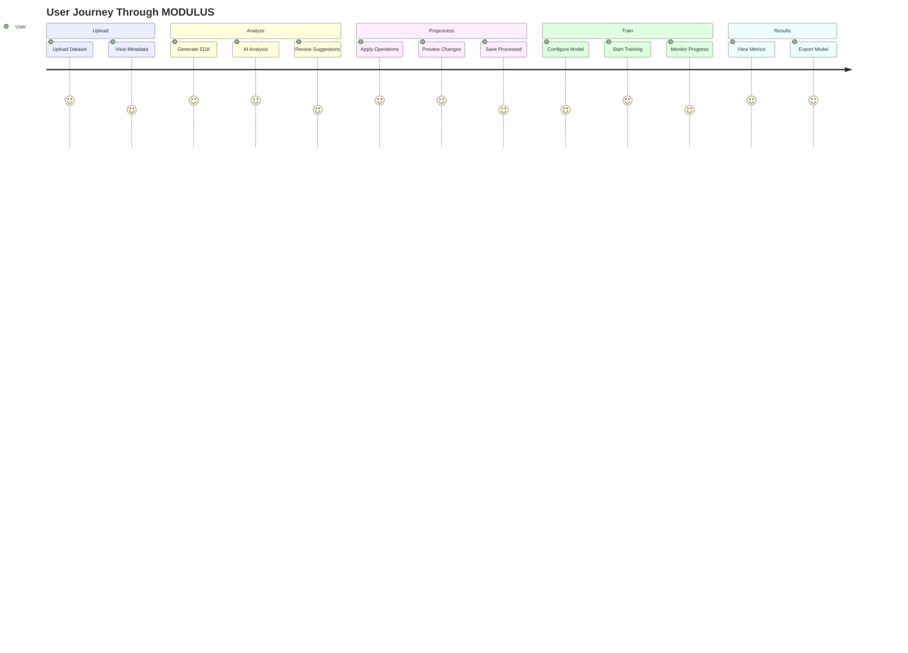

---

## Slide 8: AI-Powered Analysis

### 🤖 Intelligent Data Analysis

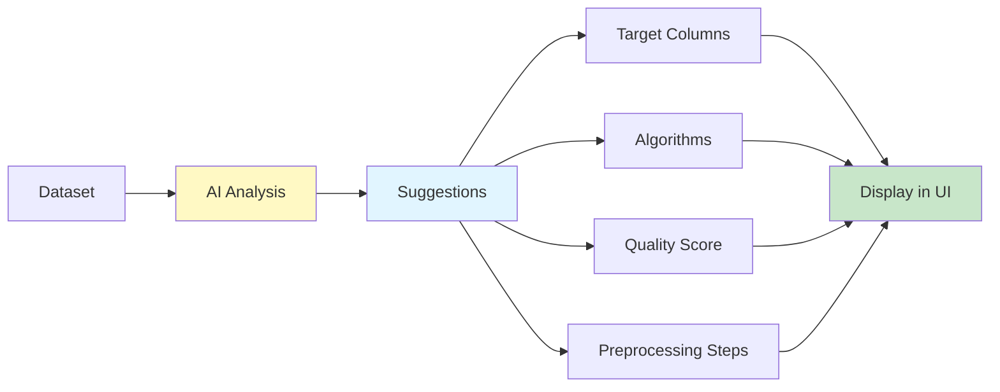

**AI Capabilities:**
- 📊 **Target Column Recommendations** with confidence scores
- 🎯 **Algorithm Suggestions** for each target
- ⭐ **Data Quality Scoring** (1-10 scale)
- 🔧 **Preprocessing Recommendations** with reasoning
- 🏢 **Business Context Analysis**

---

## Slide 9: Preprocessing Features

### 🔄 Hybrid Preprocessing System

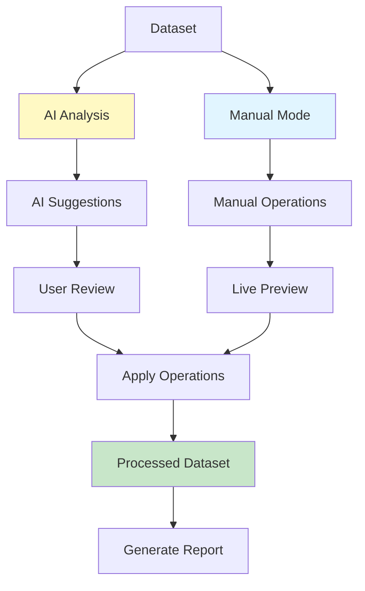

**Supported Operations:**
- ✅ Drop columns
- ✅ Type conversion
- ✅ Missing value handling (mean, median, mode, fill)
- ✅ Outlier treatment
- ✅ One-hot encoding
- ✅ Standard scaling
- ✅ Class balancing (SMOTE)

---

## Slide 10: Training Capabilities

### 🎯 Model Training

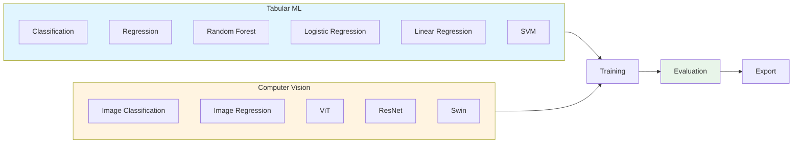

---

## Slide 11: Results & Performance

### 📊 Performance Metrics

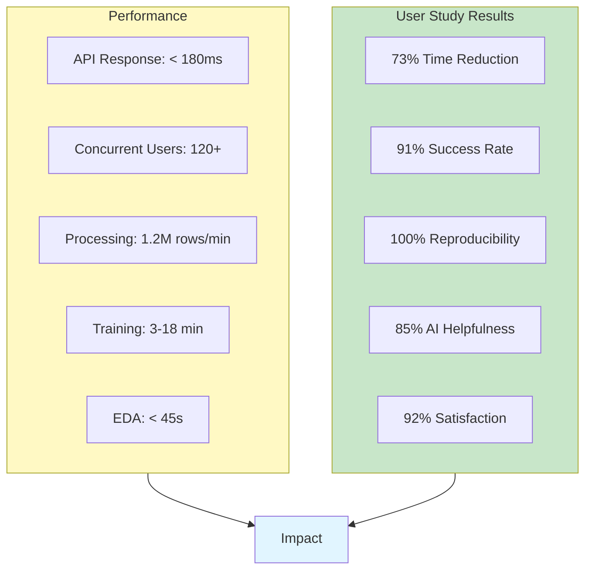

---

## Slide 12: User Interface

### 🎨 Modern UI Features

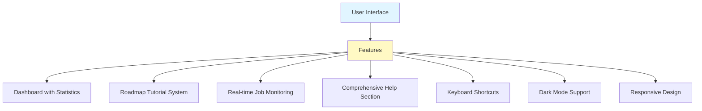

**UI Highlights:**
- 📊 Interactive dashboard with live stats
- 🗺️ Roadmap-based tutorial for onboarding
- ⌨️ Keyboard shortcuts for power users
- 🌙 Dark mode for reduced eye strain
- 📱 Responsive design (desktop/tablet)
- ❓ Comprehensive help system

---

## Slide 13: System Components

### 🧩 Core Components

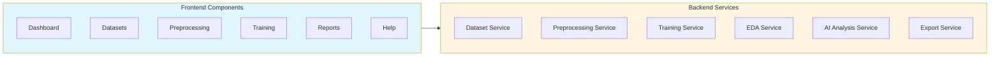

---

## Slide 14: Data Flow

### 📈 End-to-End Data Flow


---

## Slide 15: Security & Scalability

### 🔒 Security & Performance

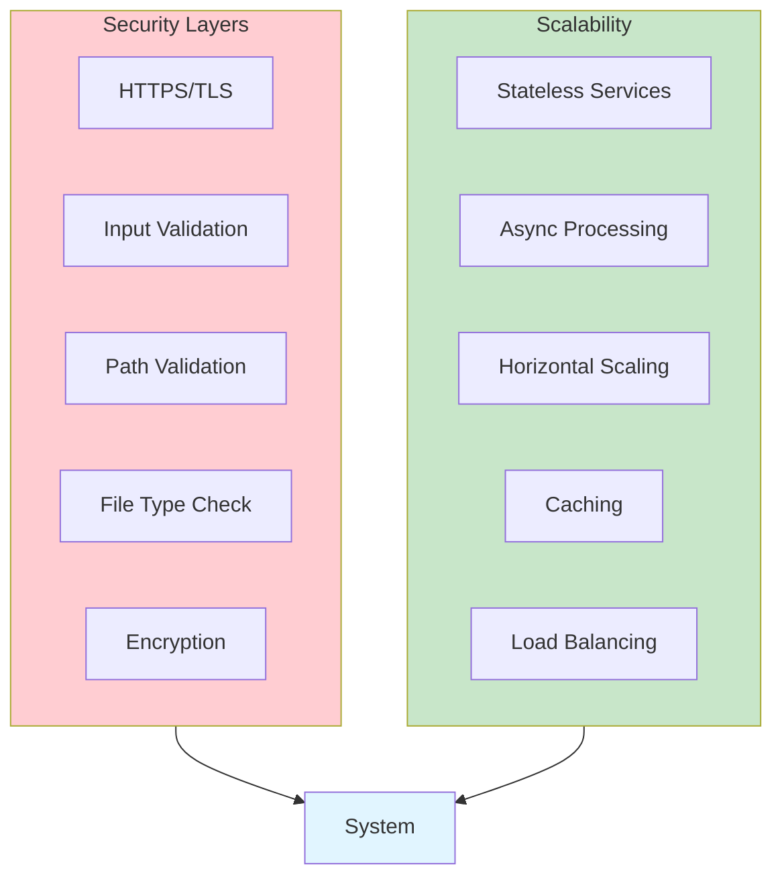

---

## Slide 16: Comparison

### MODULUS vs. Traditional Approach

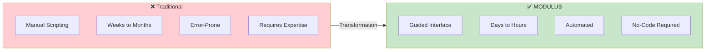

**Key Improvements:**
- ⚡ **73% faster** time-to-model
- 🎓 **91% success rate** for novices
- 🔄 **100% reproducible** pipelines
- 🤖 **AI-powered** guidance

---

## Slide 17: Use Cases

### 🎯 Real-World Applications

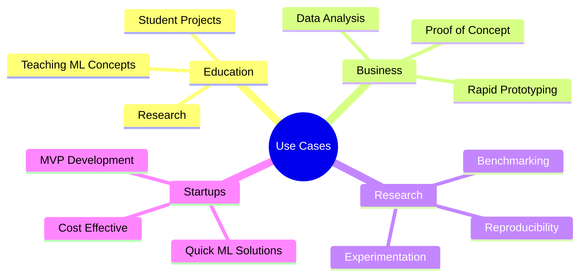

---

## Slide 18: Future Enhancements

### 🚀 Roadmap

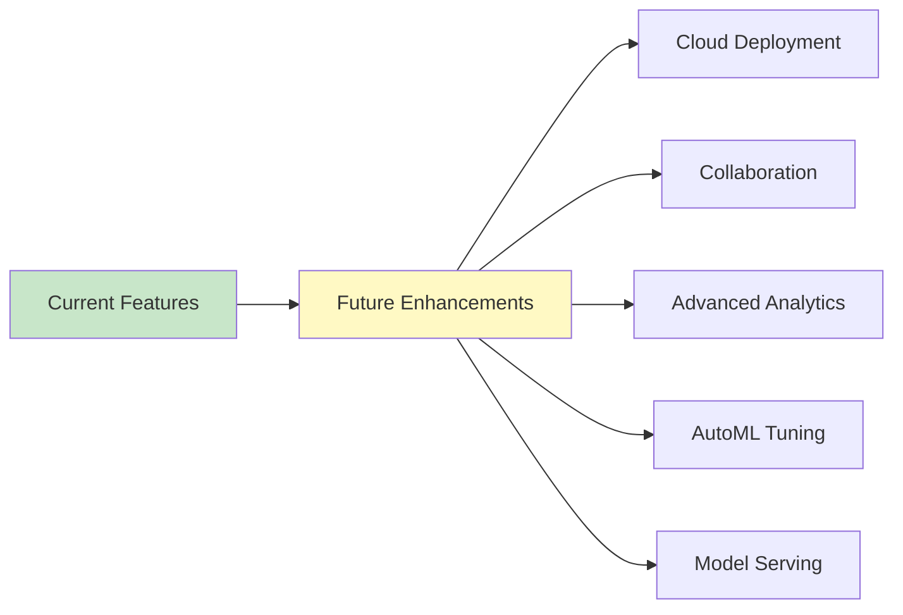

**Planned Features:**
- ☁️ Cloud deployment (Kubernetes, S3)
- 👥 Multi-user collaboration
- 📊 Advanced analytics & interpretability
- 🔍 AutoML hyperparameter optimization
- 🚀 Model deployment infrastructure

---

## Slide 19: Demo Highlights

### 🎬 Key Features Demo

**1. Dashboard**
- Real-time statistics
- Roadmap tutorial
- Recent jobs overview

**2. Dataset Management**
- Upload & preview
- AI analysis
- Metadata extraction

**3. Preprocessing**
- AI suggestions
- Manual operations
- Live preview

**4. Training**
- One-click training
- Real-time monitoring
- Comprehensive reports

**5. Reports**
- EDA reports
- Training reports
- Export packages

---

## Slide 20: Impact

### 📊 Project Impact

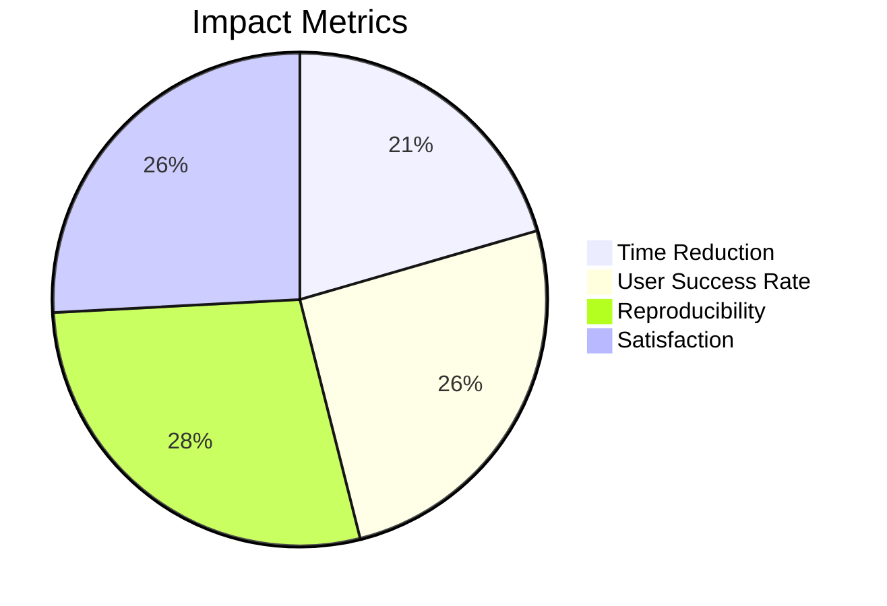

**Impact Summary:**
- ✅ **Democratized ML** - Makes ML accessible to non-experts
- ✅ **Faster Development** - Reduces time-to-model by 73%
- ✅ **Better Quality** - AI-powered suggestions improve results
- ✅ **Educational Value** - Guided tutorials help users learn
- ✅ **Reproducible** - Exportable artifacts ensure consistency

---

## Slide 21: Architecture Diagram

### 🏗️ System Architecture

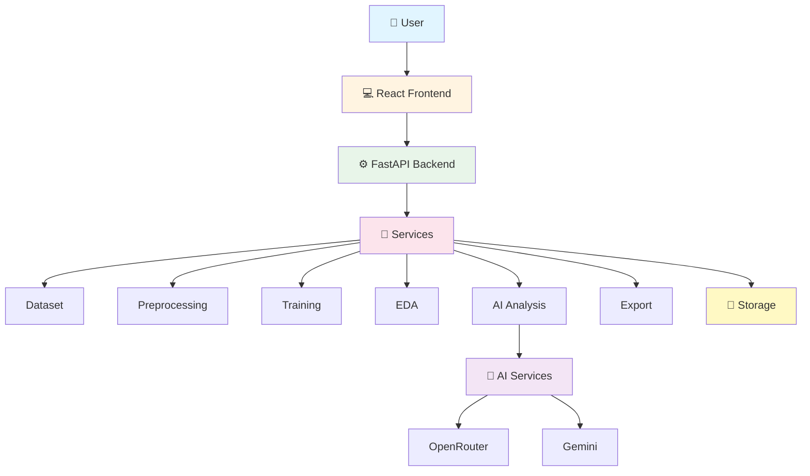

---

## Slide 22: Technology Highlights

### 💡 Technology Innovation

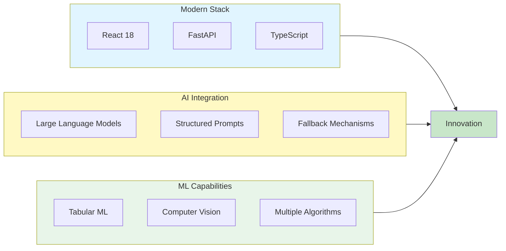

---

## Slide 23: User Experience

### 🎨 UX Features

```mermaid
graph TB
    UX[User Experience] --> Features[Features]
    
    Features --> Onboarding[Guided Onboarding]
    Features --> Tutorial[Roadmap Tutorial]
    Features --> Help[Comprehensive Help]
    Features --> Shortcuts[Keyboard Shortcuts]
    Features --> Feedback[Real-time Feedback]
    Features --> Responsive[Responsive Design]
    
    style UX fill:#e1f5ff
    style Features fill:#fff9c4
```

**UX Highlights:**
- 🗺️ **Roadmap Tutorial** - Step-by-step guidance
- ⌨️ **Keyboard Shortcuts** - Power user features
- ❓ **Help System** - Comprehensive documentation
- 📱 **Responsive** - Works on desktop & tablet
- 🌙 **Dark Mode** - Eye-friendly interface
- ⚡ **Fast Loading** - Optimized performance

---

## Slide 24: Statistics

### 📈 Key Statistics

```mermaid
graph LR
    subgraph Stats["Statistics"]
        S1["7 Core Services"]
        S2["12+ API Endpoints"]
        S3["6 Frontend Pages"]
        S4["2 AI Providers"]
        S5["5+ ML Algorithms"]
        S6["100% Reproducible"]
    end
    
    Stats --> Impact[Impact]
    
    style Stats fill:#fff9c4
    style Impact fill:#c8e6c9
```

**Numbers:**
- 📊 **7** Core backend services
- 🔌 **12+** API endpoints
- 📄 **6** Frontend pages
- 🤖 **2** AI service providers
- 🎯 **5+** ML algorithms
- ✅ **100%** Reproducible pipelines

---

## Slide 25: Conclusion

### 🎯 Summary

```mermaid
graph TB
    Problem[ML Workflow Problems] --> Solution[MODULUS Solution]
    
    Solution --> Benefits[Benefits]
    
    Benefits --> B1[Fast]
    Benefits --> B2[Easy]
    Benefits --> B3[AI-Powered]
    Benefits --> B4[Reproducible]
    
    Benefits --> Impact[Impact]
    
    Impact --> I1[Democratized ML]
    Impact --> I2[Faster Development]
    Impact --> I3[Educational Value]
    
    style Solution fill:#c8e6c9
    style Benefits fill:#fff9c4
    style Impact fill:#e1f5ff
```

**MODULUS:**
- ✅ Simplifies ML workflows
- ✅ Makes ML accessible to all
- ✅ Provides AI-powered guidance
- ✅ Ensures reproducibility
- ✅ Ideal for education & prototyping

---

## Slide 26: Thank You

# 🙏 Thank You!

## Questions?

**Contact:**
- 📧 Project Repository: [GitHub]
- 📖 Documentation: Available in `/docs`
- 🎓 Educational Resource: Open for learning

**MODULUS** - Making Machine Learning Accessible to Everyone 🚀

---

## Appendix: Diagram Sources

All diagrams in this presentation are created using Mermaid syntax and can be:
- Rendered in Markdown viewers
- Exported to PNG/PDF
- Embedded in web pages
- Converted for LaTeX inclusion

**Tools:**
- [Mermaid Live Editor](https://mermaid.live/)
- VS Code with Mermaid extension
- GitHub/GitLab native support

---

## Presentation Tips

### For Presenters:
1. **Use infographics** - Visual diagrams are more engaging
2. **Tell a story** - Connect slides with narrative flow
3. **Demo live** - Show actual system in action
4. **Highlight impact** - Emphasize user benefits
5. **Keep it simple** - Avoid technical jargon for general audience

### Slide Flow:
1. Problem → Solution → Features → Demo → Impact → Future

### Visual Style:
- Use consistent color scheme
- Keep text minimal, visuals prominent
- Use animations for transitions
- Include real screenshots from the system

