# MODULUS Research Paper - Required Diagrams

This document contains all diagrams required for the research paper in Mermaid format. These diagrams can be rendered in Markdown viewers, exported to PNG/PDF, or converted for LaTeX inclusion.

## 1. System Architecture Diagram (`figures/system_architecture.png`)

**Placeholder in paper:** Line 159  
**Description:** High-level system architecture showing frontend, API gateway, services, and data layers

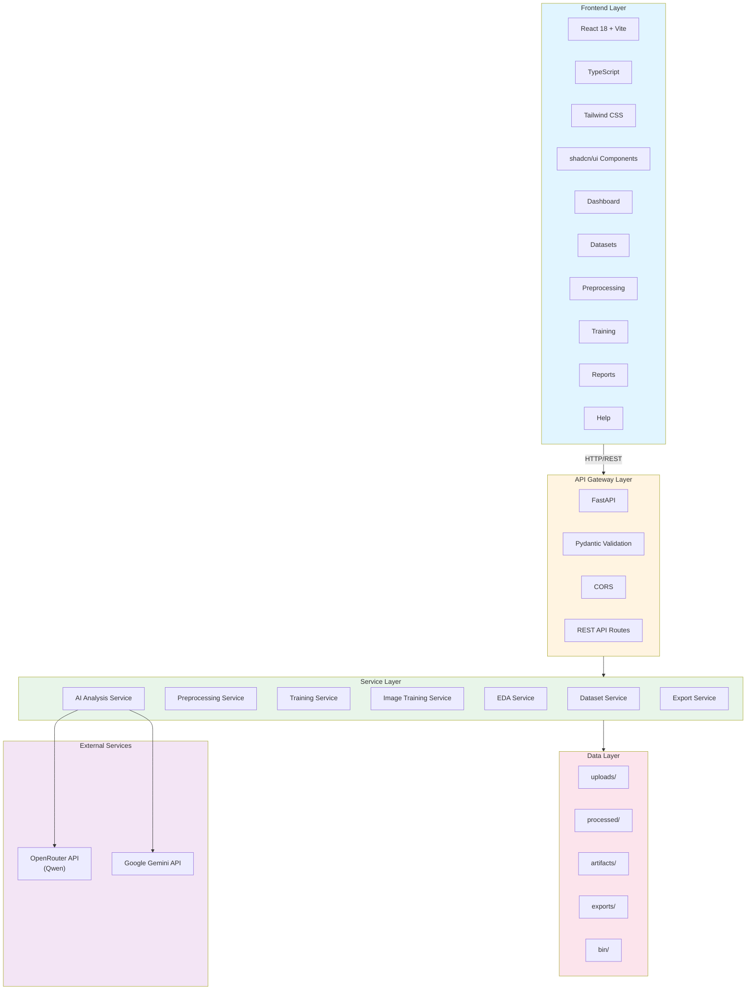

---

## 2. Data Flow Diagram (`figures/data_flow.png`)

**Placeholder in paper:** Line 200  
**Description:** End-to-end data flow from upload to exportable artifacts

```mermaid
flowchart LR
    Start([User Uploads<br/>Dataset]) --> Validate[File Validation<br/>& Schema Check]
    Validate -->|Valid| Store1[(Storage:<br/>uploads/)]
    Validate -->|Invalid| Error1[Error Message]

    Store1 --> EDA[EDA Generation]
    EDA --> Report1[HTML Report]
    Report1 --> Store2[(Storage:<br/>artifacts/)]

    Store1 --> Preprocess[Preprocessing]
    Preprocess --> AI[AI Analysis]
    AI --> Suggestions[Suggestions]
    Suggestions --> Manual[Manual/Auto<br/>Operations]
    Manual --> Preview[Preview]
    Preview --> Processed[Processed Dataset]
    Processed --> Store3[(Storage:<br/>processed/)]

    Store3 --> Train[Model Training]
    Train --> Eval[Evaluation]
    Eval --> Model[Model + Report]
    Model --> Store4[(Storage:<br/>artifacts/)]

    Store4 --> Export[Export Package]
    Export --> ZIP[ZIP File]
    ZIP --> Store5[(Storage:<br/>exports/)]

    Store5 --> Download([User Downloads<br/>Export Package])

    style Start fill:#c8e6c9
    style Download fill:#c8e6c9
    style Store1 fill:#fff9c4
    style Store2 fill:#fff9c4
    style Store3 fill:#fff9c4
    style Store4 fill:#fff9c4
    style Store5 fill:#fff9c4
    style Error1 fill:#ffcdd2
```

---

## 3. API Flow Diagram (`figures/api_flow.png`)

**Placeholder in paper:** Line 210  
**Description:** API request/response patterns and asynchronous processing

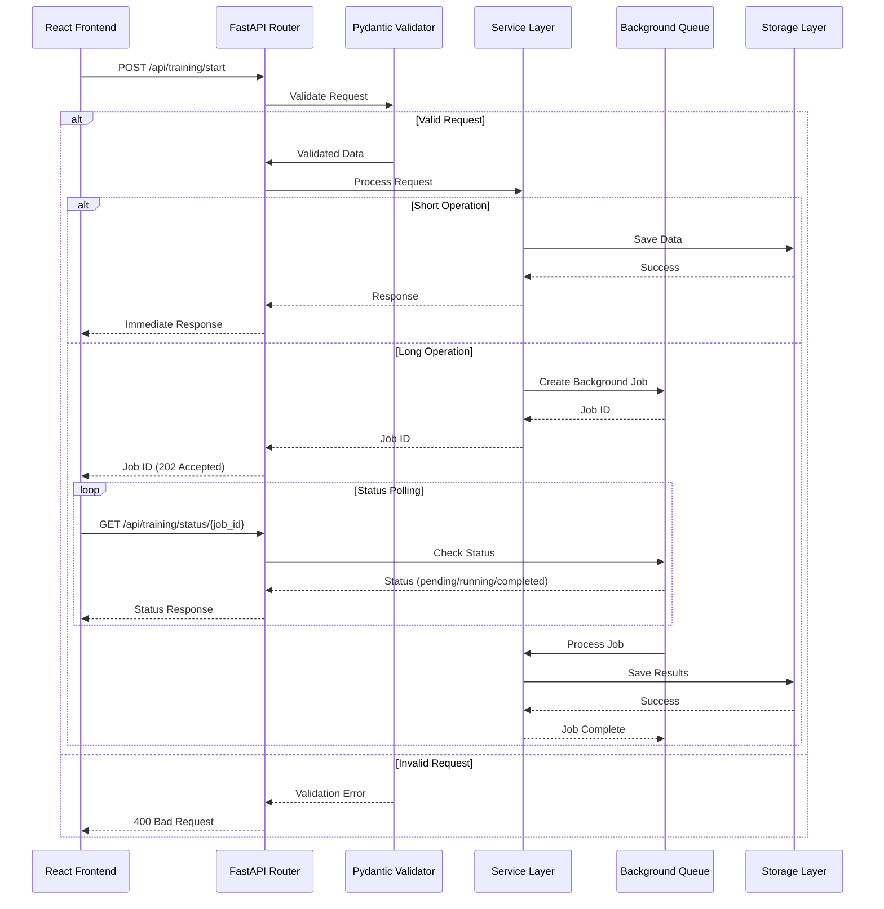

---

## 4. Security Architecture Diagram (`figures/security_architecture.png`)

**Placeholder in paper:** Line 222  
**Description:** Defense in depth security layers

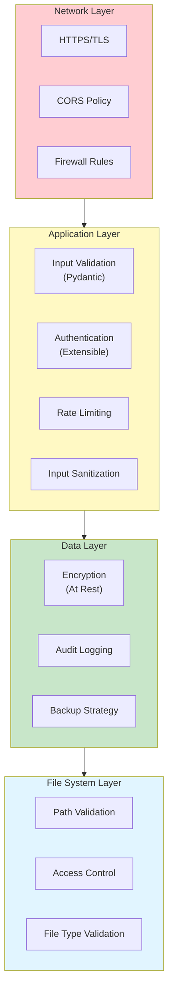

---

## 5. Technology Stack Diagram (`figures/tech_stack.png`)

**Placeholder in paper:** Line 244  
**Description:** Technology stack visualization

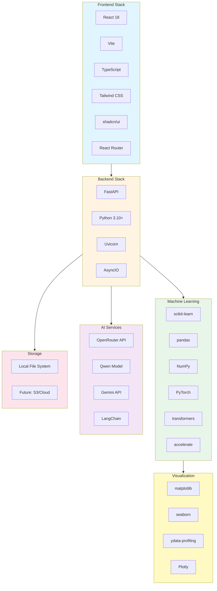

---

## 6. Motivation Icons Diagram (`figures/motivation_icons.png`)

**Placeholder in paper:** Line 128  
**Description:** Visual representation of ML workflow challenges

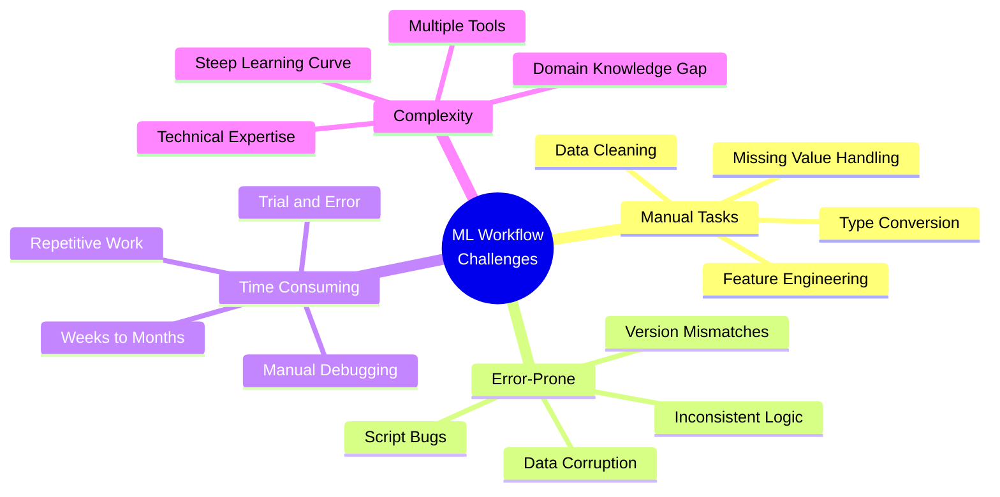

---

## 7. Problem Statement Diagram (`figures/problem_diagram.png`)

**Placeholder in paper:** Line 139  
**Description:** Current problems vs. MODULUS solution

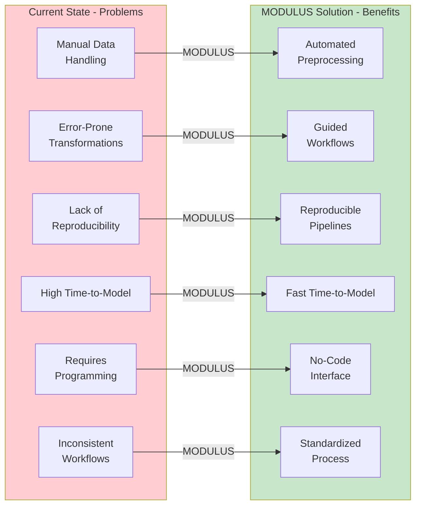

---

## Additional Suggested Diagrams

### 8. Preprocessing Workflow Diagram (`figures/preprocessing_workflow.png`)

**Description:** Detailed preprocessing workflow showing AI analysis, manual operations, and preview

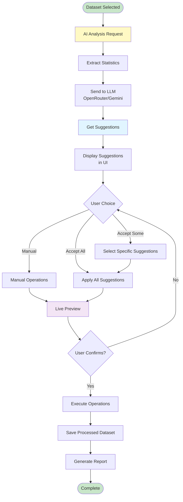

---

### 9. Training Pipeline Diagram (`figures/training_pipeline.png`)

**Description:** Training pipeline for tabular and CV tasks

```mermaid
flowchart LR
    subgraph DataPrep["Data Preparation"]
        Load[Load Dataset] --> Split[Train/Val/Test Split]
        Split --> Features[Feature Engineering]
    end

    subgraph Training["Training"]
        Features --> Select[Model Selection]
        Select --> Config[Configure Parameters]
        Config --> Train[Training Loop]
        Train --> Eval[Evaluation]
    end

    subgraph Persist["Persistence"]
        Eval --> Metrics[Calculate Metrics]
        Metrics --> SaveModel[Save Model]
        SaveModel --> Report[Generate Report]
        Report --> Artifacts[(Artifacts Storage)]
    end

    DataPrep --> Training
    Training --> Persist

    style DataPrep fill:#e1f5ff
    style Training fill:#fff9c4
    style Persist fill:#e8f5e9
```

---

### 10. User Journey Map (`figures/user_journey.png`)

**Description:** User journey from first visit to model export

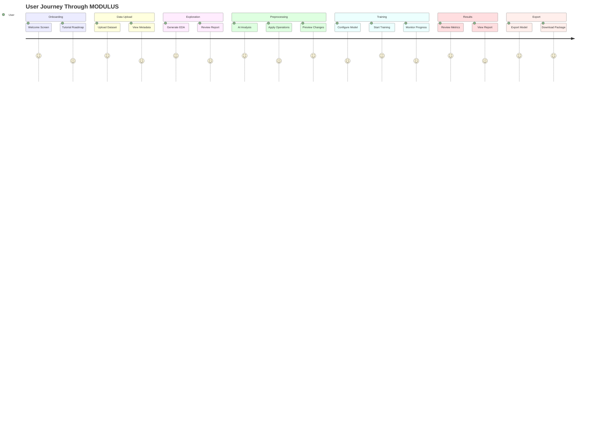

---

### 11. Component Interaction Diagram (`figures/component_interaction.png`)

**Description:** How different components interact (UML-style)

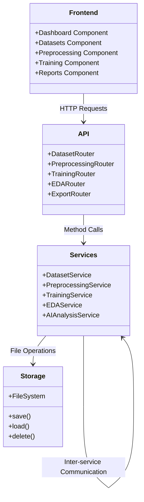

---

### 12. AI Analysis Flow Diagram (`figures/ai_analysis_flow.png`)

**Description:** AI-powered analysis workflow

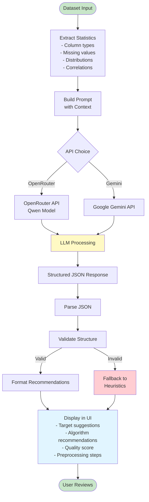

---

## Implementation Notes

### Mermaid Rendering:

1. **Online:** Use [Mermaid Live Editor](https://mermaid.live/) to render and export diagrams
2. **VS Code:** Install "Markdown Preview Mermaid Support" extension
3. **GitHub/GitLab:** Native Mermaid support in Markdown files
4. **Export:** Use Mermaid CLI or online tools to export as PNG/PDF/SVG

### Converting to LaTeX:

1. Render Mermaid diagrams to SVG using Mermaid CLI or online tools
2. Convert SVG to PNG/PDF at 300 DPI
3. Include in LaTeX using `\includegraphics`

### Format Requirements:

- **Resolution:** Minimum 300 DPI for print
- **Format:** PNG or PDF (PDF preferred for vector graphics)
- **Size:** Fit within IEEE column width (3.5 inches) or full page width (7 inches)
- **Colors:** Ensure diagrams are readable in grayscale (IEEE prints in black & white)

### Diagram Placement:

- Place diagrams close to their first reference in text
- Use `[t]` for top placement, `[b]` for bottom, `[h]` for here
- Use `\centering` for center alignment
- Ensure captions are descriptive and include figure numbers

### Style Guidelines:

- Use consistent color scheme across diagrams
- Clear labels and legends
- Appropriate font sizes (readable at print size)
- Professional appearance
- Avoid clutter, focus on clarity

---

## Diagram Creation Checklist

- [x] System Architecture Diagram (Mermaid)
- [x] Data Flow Diagram (Mermaid)
- [x] API Flow Diagram (Mermaid)
- [x] Security Architecture Diagram (Mermaid)
- [x] Technology Stack Diagram (Mermaid)
- [x] Motivation Icons Diagram (Mermaid)
- [x] Problem Statement Diagram (Mermaid)
- [x] Preprocessing Workflow Diagram (Mermaid)
- [x] Training Pipeline Diagram (Mermaid)
- [x] User Journey Map (Mermaid)
- [x] Component Interaction Diagram (Mermaid)
- [x] AI Analysis Flow Diagram (Mermaid)

---

## Quick Implementation Tips

1. **Render Mermaid:** Use [Mermaid Live Editor](https://mermaid.live/) to preview and export
2. **Export Options:** PNG for raster, SVG/PDF for vector
3. **Customization:** Adjust colors and styles in Mermaid syntax
4. **Test Readability:** Convert to grayscale to ensure IEEE print compatibility
5. **Iterate:** Create multiple versions and choose the clearest
6. **Maintain Consistency:** Use same color scheme across all diagrams
7. **Document Sources:** If using external templates, ensure proper attribution

---

## File Organization

Place all exported diagrams in: `docs/researchPaper/figures/`

```
docs/researchPaper/
├── figures/
│   ├── system_architecture.png
│   ├── data_flow.png
│   ├── api_flow.png
│   ├── security_architecture.png
│   ├── tech_stack.png
│   ├── motivation_icons.png
│   ├── problem_diagram.png
│   ├── preprocessing_workflow.png
│   ├── training_pipeline.png
│   ├── user_journey.png
│   ├── component_interaction.png
│   └── ai_analysis_flow.png
├── researchpaper.tex
├── references.bib
└── diagrams.md (this file)
```

---

## Exporting Mermaid Diagrams

### Using Mermaid CLI:

```bash
# Install Mermaid CLI
npm install -g @mermaid-js/mermaid-cli

# Export diagram
mmdc -i diagrams.md -o figures/ -e png -b white
```

### Using Online Tools:

1. Go to [Mermaid Live Editor](https://mermaid.live/)
2. Copy Mermaid code from this file
3. Paste into editor
4. Click "Export" → Choose format (PNG/PDF/SVG)
5. Save to `figures/` directory

### Using VS Code:

1. Install "Markdown Preview Mermaid Support" extension
2. Open this markdown file
3. Preview diagrams
4. Right-click → Save as image
