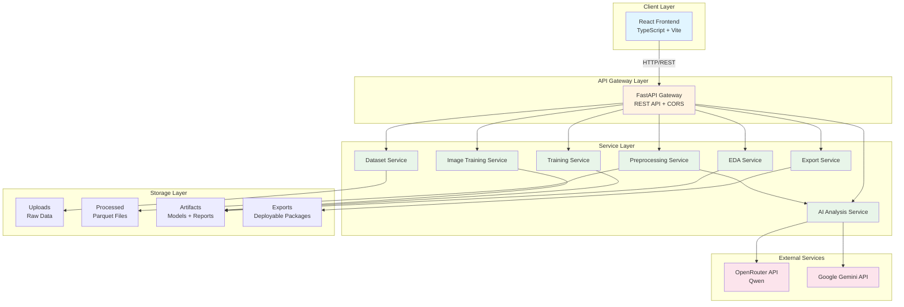
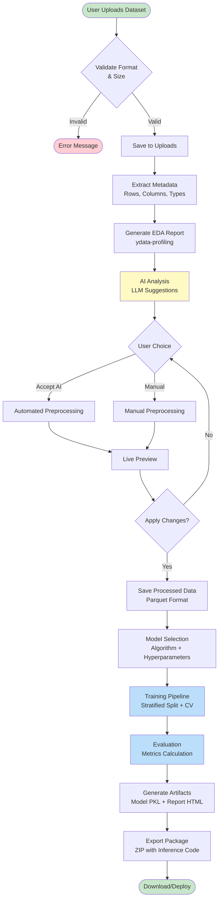
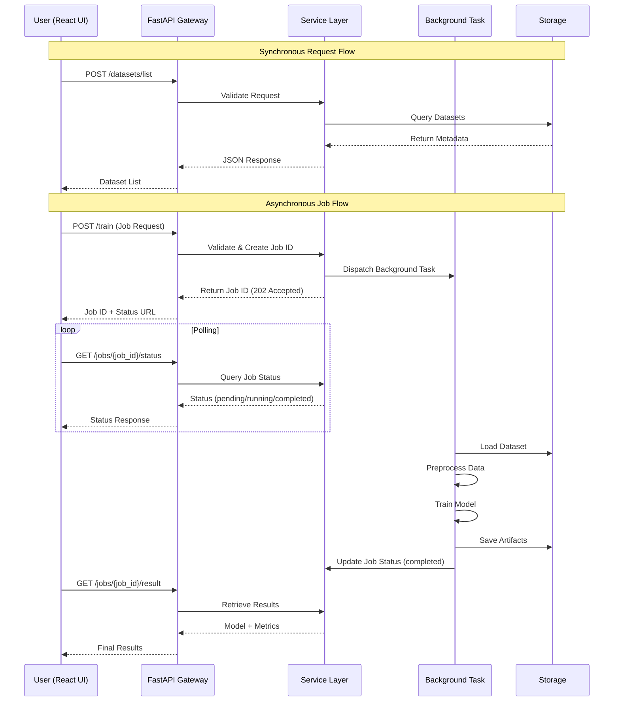
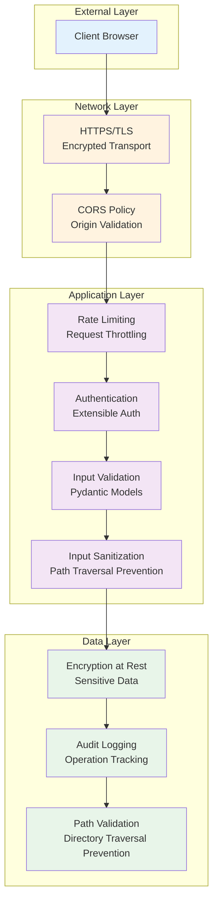
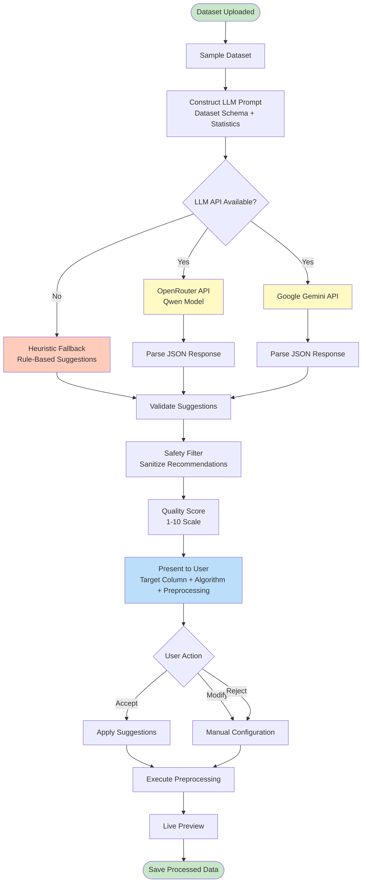
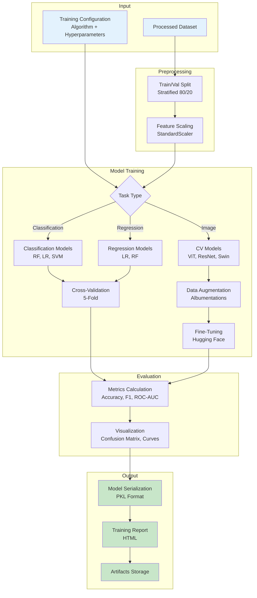
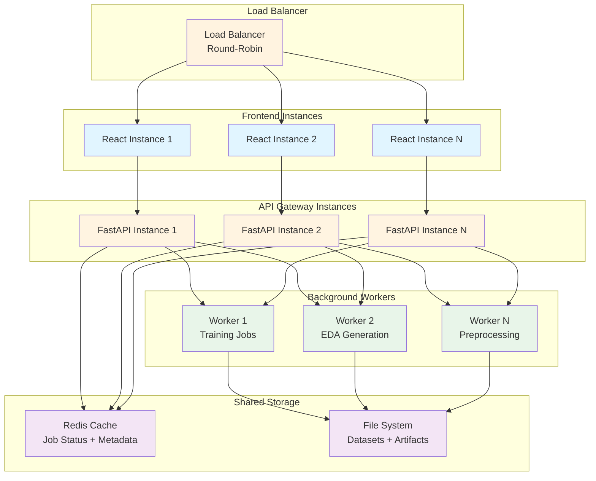
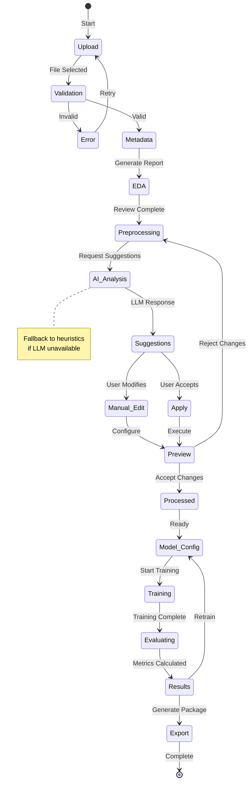

# MODULUS Research Paper Diagrams (Mermaid Format)

This document contains all relevant diagrams for the MODULUS research paper in Mermaid format. These diagrams are designed to fit properly in IEEE Transactions format and can be converted to LaTeX-compatible formats.

---

## 1. High-Level System Architecture



---

## 2. End-to-End Data Flow



---

## 3. API Request Flow (Asynchronous Processing)



---

## 4. Security Architecture (Defense in Depth)



---

## 5. ML Pipeline Workflow

```mermaid
flowchart LR
    subgraph "Phase 1: Data Preparation"
        D1[Raw Dataset] --> D2[Validation]
        D2 --> D3[Metadata Extraction]
        D3 --> D4[EDA Report]
        D4 --> D5[AI Analysis]
        D5 --> D6[Preprocessing]
        D6 --> D7[Processed Dataset]
    end
    
    subgraph "Phase 2: Model Training"
        D7 --> M1[Train/Val Split]
        M1 --> M2[Feature Engineering]
        M2 --> M3[Algorithm Selection]
        M3 --> M4[Hyperparameter Tuning]
        M4 --> M5[Cross-Validation]
        M5 --> M6[Trained Model]
    end
    
    subgraph "Phase 3: Evaluation & Export"
        M6 --> E1[Metrics Calculation]
        E1 --> E2[Visualization]
        E2 --> E3[Report Generation]
        E3 --> E4[Model Serialization]
        E4 --> E5[Export Package]
    end
    
    style D1 fill:#ffebee
    style D7 fill:#e8f5e9
    style M6 fill:#e3f2fd
    style E5 fill:#fff9c4
```



---

## 6. Component Interaction Diagram

```mermaid
graph LR
    subgraph "Frontend Components"
        DASH[Dashboard]
        DATASET[Dataset Manager]
        PREP_UI[Preprocessing UI]
        TRAIN_UI[Training UI]
        REPORTS[Reports Viewer]
    end
    
    subgraph "API Endpoints"
        DS_API[/datasets]
        PREP_API[/preprocessing]
        TRAIN_API[/training]
        EXP_API[/export]
        AI_API[/ai-analysis]
    end
    
    subgraph "Backend Services"
        DS_SVC[Dataset Service]
        PREP_SVC[Preprocessing Service]
        TRAIN_SVC[Training Service]
        AI_SVC[AI Analysis Service]
        EXP_SVC[Export Service]
    end
    
    DASH --> DS_API
    DATASET --> DS_API
    PREP_UI --> PREP_API
    TRAIN_UI --> TRAIN_API
    REPORTS --> EXP_API
    
    DS_API --> DS_SVC
    PREP_API --> PREP_SVC
    TRAIN_API --> TRAIN_SVC
    AI_API --> AI_SVC
    EXP_API --> EXP_SVC
    
    PREP_SVC --> AI_SVC
    TRAIN_SVC --> EXP_SVC
    
    style DASH fill:#e1f5ff
    style DATASET fill:#e1f5ff
    style PREP_UI fill:#e1f5ff
    style TRAIN_UI fill:#e1f5ff
    style REPORTS fill:#e1f5ff
    style DS_API fill:#fff4e1
    style PREP_API fill:#fff4e1
    style TRAIN_API fill:#fff4e1
    style EXP_API fill:#fff4e1
    style AI_API fill:#fff4e1
    style DS_SVC fill:#e8f5e9
    style PREP_SVC fill:#e8f5e9
    style TRAIN_SVC fill:#e8f5e9
    style AI_SVC fill:#e8f5e9
    style EXP_SVC fill:#e8f5e9
```

---

## 7. AI-Powered Preprocessing Flow



---

## 8. Training Pipeline Architecture



---

## 9. System Scalability Architecture



---

## 10. User Workflow State Machine



---

## Usage Instructions

These Mermaid diagrams can be:

1. **Rendered in Markdown viewers**: GitHub, GitLab, VS Code with Mermaid extension
2. **Converted to images**: Use Mermaid CLI (`mmdc`) or online tools
3. **Integrated into LaTeX**: Convert to PDF/SVG and include with `\includegraphics`
4. **Exported for IEEE format**: Use appropriate sizing (column width: ~3.5in for single column)

### Recommended Sizes for IEEE Transactions:
- Single column: 3.5 inches width
- Double column: 7 inches width
- Maintain aspect ratio for readability

### Conversion Commands:
```bash
# Install Mermaid CLI
npm install -g @mermaid-js/mermaid-cli

# Convert to PNG
mmdc -i diagrams.md -o output.png -w 1200 -H 800

# Convert to SVG (better for LaTeX)
mmdc -i diagrams.md -o output.svg
```
